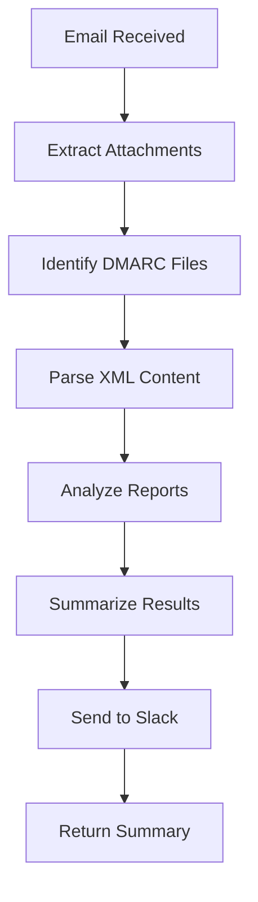

<div align="center">
     <br/>
    <strong>Build Agents, Not Infrastructure</strong> <br/>
	<br/>
		<a target="_blank" href="https://app.agentuity.com/deploy" alt="Agentuity">
			 
		</a>

<br />
</div>

# 📧 DMARC Email Report Processing Agent

Welcome to the DMARC Email Processing Agent! This project automatically processes DMARC reports received via email, analyzes them, and sends notifications to Slack. Built with the Agentuity platform for reliable, scalable email automation.

## 📋 Prerequisites

Before you begin, ensure you have the following installed:

- **Python**: Version 3.10 or higher
- **UV**: Version 0.5.25 or higher ([Documentation](https://docs.astral.sh/uv/))

## 🚀 Getting Started

### Authentication

Before using Agentuity, you need to authenticate:

```bash
agentuity login
```

This command will open a browser window where you can log in to your Agentuity account.

### Development Mode

Run your project in development mode with:

```bash
agentuity dev
```

This will start your project and open a new browser window connecting your Agent to the Agentuity Console in Live Mode, allowing you to test and debug your agent in real-time.

You can also start your project in development mode without connecting to the Agentuity Console:

```bash
uv run --env-file .env server.py
```

## 📚 Project Structure

```
├── agents/             # Agent definitions and implementations
│   └── dmarc_email/    # DMARC email processing agent
├── utils/              # Utility modules
│   ├── slack.py        # Slack integration utilities with retry logic
│   ├── retry.py        # Async retry decorator with exponential backoff
│   └── validators.py   # Input validation for attachments and XML
├── resources/          # Resource files and templates
│   └── templates.py    # Email and notification templates
├── bin/                # Scripts and executables
│   └── develop.sh      # Development setup script
├── .agentuity/         # Agentuity configuration files
├── config.py           # Centralized configuration management
├── pyproject.toml      # Project dependencies and metadata
├── uv.lock             # UV lock file for reproducible builds
├── server.py           # Server entry point with config validation
└── agentuity.yaml      # Agentuity project configuration
```

## 🔄 Agent Flow Diagram

The DMARC Email Processing Agent follows a structured workflow starting from the `run()` method in `agents/dmarc_email/agent.py`:



### Input and Output

#### Input
- **DMARC Report Emails**: Emails sent to the agent's Email IO address
- **Attachment Types**: XML, ZIP, or GZ files containing DMARC reports
- **XML Content**: DMARC reports in XML format containing authentication results

#### Processing
1. **Email Reception**: Receive emails via Agentuity Email IO
2. **Attachment Validation**: Validate attachment size and format
3. **Format Detection**: Identify DMARC files (XML, gzipped XML, ZIP)
4. **Content Extraction**: Parse and extract DMARC XML reports from attachments using secure defusedxml parser
5. **XML Validation**: Verify XML structure and DMARC report format
6. **Analysis**: Process reports using OpenAI (configurable model) with specialized prompts and automatic retry
7. **Summarization**: Generate concise summaries of analysis results with retry logic
8. **Storage**: Store analysis results in Agentuity KV store with unique keys
9. **Slack Notification**: Send analysis to Slack channel with retry and exponential backoff

#### Output
- **JSON Response**: Summary of DMARC analysis returned by the agent
- **Slack Notifications**: Analysis results sent to configured Slack channel

## 🔧 Configuration

### Agentuity Configuration

Your project configuration is stored in `agentuity.yaml`. This file defines your agents, development settings, and deployment configuration.

### Environment Variables

The agent supports the following environment variables for customization:

#### Required Variables
- **`SLACK_BOT_TOKEN`**: Your Slack bot token for sending notifications
- **`DMARC_CHANNEL_ID`**: The Slack channel ID where DMARC reports will be posted
- **`AGENTUITY_SDK_KEY`**: Your Agentuity SDK key (set automatically by Agentuity CLI)

#### Optional Variables
- **`OPENAI_MODEL`**: OpenAI model to use for analysis (default: `gpt-4.1`)
- **`OPENAI_MAX_RETRIES`**: Maximum retry attempts for OpenAI API calls (default: `3`)
- **`OPENAI_TIMEOUT`**: Timeout in seconds for OpenAI API calls (default: `60`)
- **`SLACK_MAX_RETRIES`**: Maximum retry attempts for Slack API calls (default: `3`)
- **`MAX_ATTACHMENT_SIZE_MB`**: Maximum attachment size in MB (default: `25`)
- **`MAX_ATTACHMENTS_PER_EMAIL`**: Maximum number of attachments per email (default: `10`)

### Configuration File

Centralized configuration is managed in `config.py` with automatic validation on startup. The agent will fail fast if required configuration is missing.

## 🛠️ Advanced Usage

### Environment Variables

You can set environment variables for your project:

```bash
agentuity env set KEY=VALUE
```

### Secrets Management

For sensitive information, use secrets:

```bash
agentuity env set --secret KEY=VALUE
```

## 🚀 Production Deployment

To deploy this agent in a production environment (non-interactive, headless, or cloud):

### 1. Set Required Environment Variables
Set the following environment variables in your production environment `.env`

```
SLACK_BOT_TOKEN=<your Slack bot token>
DMARC_CHANNEL_ID=<your Slack channel ID>
AGENTUITY_SDK_KEY=<your Agentuity SDK key>
ENVIRONMENT=production|development
```

### 2. Import Project
- If you don't already have a project created for this project, you can run `agentuity project import` in this repository to import this project to your Agentuity account. This will create a new Agentuity project, and automatically updates `agentuity.yaml` to point to your new project and agent_id

### 3. Deploy Your Code
- Ensure your environment variables are set
- Deploy your project to production with `agentuity deploy`

### 4. Set Up Email IO
- Visit your Agentuity dashboard and navigate to your DMARC project
- Go to the `Agents` tab and find your `dmarc_email` agent
- Add a new Email IO by clicking on the Email option
- Copy the generated email address (e.g., `agent_id@agentuity.run`)
- Configure your DMARC email routing to forward reports to this agentic email address
- Save the Email IO settings

### 5. Test Your Agent
- Send a test DMARC report email to the agentic email address
- Check your Slack channel for the analysis results
- Monitor the agent logs in the Agentuity dashboard for any issues

## 📖 Documentation

For comprehensive documentation on the Agentuity Python SDK, visit:
[https://agentuity.dev/SDKs/python](https://agentuity.dev/SDKs/python)

## 🆘 Troubleshooting

### Common Issues

#### Configuration Errors
If you see configuration validation errors on startup:
- Ensure `SLACK_BOT_TOKEN` is set in your environment
- Ensure `DMARC_CHANNEL_ID` is set in your environment
- Check that your `.env` file is properly formatted

#### OpenAI API Errors
The agent includes automatic retry logic for:
- Rate limit errors (429)
- API errors (500, 503)
- Timeout errors

If you still experience issues:
- Check your OpenAI API key is valid
- Verify you have sufficient API quota
- Try increasing `OPENAI_TIMEOUT` for slower responses

#### Slack Integration Issues
The agent retries Slack API calls automatically for:
- Rate limiting
- Timeouts
- Service unavailability

If messages aren't appearing:
- Verify your `SLACK_BOT_TOKEN` is valid
- Ensure the bot has permission to post in `DMARC_CHANNEL_ID`
- Check the bot is invited to the target channel

#### Attachment Processing Errors
- **Oversized attachments**: Default limit is 25MB, increase `MAX_ATTACHMENT_SIZE_MB` if needed
- **Invalid XML**: The agent validates XML structure and skips malformed files
- **Non-DMARC files**: Only files with DMARC-related names or extensions are processed

### Getting Help

If you encounter any issues:

1. Check the [documentation](https://agentuity.dev/SDKs/python)
2. Join our [Discord community](https://discord.com/invite/vtn3hgUfuc) for support
3. Contact the Agentuity support team

## 🔐 Security Features

- **Secure XML Parsing**: Uses `defusedxml` to prevent XXE and other XML-based attacks
- **Input Validation**: Validates attachment sizes and XML structure before processing
- **Configuration Validation**: Validates required configuration on startup to fail fast
- **Error Handling**: Comprehensive error handling with retry logic for transient failures

## 📝 License

This project is licensed under the terms specified in the LICENSE file.
